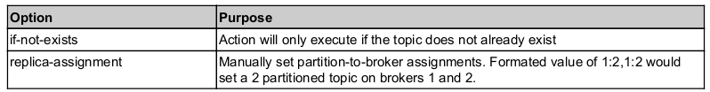

## Useful commands
```
KH=/usr/local/kafka/bin
ZK=zk1:2181,zk2:2181,zk3:2181/sin-kafka
BS=broker:9092
```

To create a topic:
```
sudo ${KH}/kafka-topics.sh --create --zookeeper ${ZK} --replication-factor 1 --partitions 1 --topic test

sudo "${KH}"/kafka-topics.sh --create --zookeeper "${ZK}" --if-not-exists --topic events.failedEnriched   --partitions=1 --replication-factor=1 --config retention.bytes=-1 --config retention.ms=432000000 --config message.timestamp.difference.max.ms=432000000 --config min.insync.replicas=1 --config message.timestamp.type=LogAppendTime --config max.message.bytes=274857600

```


To delete a topic:
```
sudo ${KH}/kafka-topics.sh --zookeeper ${ZK}:2181 --delete --topic my_test_topic
```

To list the available topics:
```
sudo ${KH}/kafka-topics.sh --list --zookeeper ${ZK}
```
or
```
export KAFKA_HEAP_OPTS="-Xmx2g -Xms2g -XX:ParallelGCThreads=12" ;bash /usr/local/kafka/bin/kafka-run-class.sh kafka.admin.TopicCommand --zookeeper zk1 :2181,zk2 :2181,zk3 :2181/sin-kafka --list ; unset KAFKA_HEAP_OPTS
```
or use zkCli.sh from zookeeper installation

To start console consumer and producer:
```
sudo ${KH}/kafka-console-producer.sh --broker-list `hostname`:9092 --topic events.raw
sudo ${KH}/kafka-console-consumer.sh --bootstrap-server `hostname`:9092 --topic events.raw
use --from-beginning to consume all events, not only those that are being produced in parallel by producer
```


Describe topics (will also show ISR):
```
sudo ${KH}/kafka-topics.sh --zookeeper "${ZK}" --describe --topic events.raw
```

To see under-replicated partitions:
```
sudo ${KH}/kafka-topics.sh --zookeeper "${ZK}" --describe --under-replicated-partitions
```

List consumer groups:
```
sudo ${KH}/kafka-consumer-groups.sh --zookeeper ${ZK}  -list
```

Describe consumer groups:
```
sudo ${KH}/kafka-consumer-groups.sh --zookeeper "${ZK}" --list \
| grep "my_topic" \
| xargs -I{} sudo ${KH}/kafka-consumer-groups.sh --zookeeper "${ZK}" --describe --group {}
```
or
```
export KAFKA_HEAP_OPTS="-Xmx2g -Xms2g -XX:ParallelGCThreads=12" ;bash /usr/local/kafka/bin/kafka-run-class.sh kafka.admin.ConsumerGroupCommand --zookeeper zk1:2181,zk2:2181,zk3:2181/my-kafka --list |grep "my_topic_suffix" | xargs -I{} /usr/local/kafka/bin/kafka-consumer-groups.sh --zookeeper zk1:2181,zk2:2181,zk3:2181/my-kafka --describe --group {} ; unset KAFKA_HEAP_OPTS
```

To read messages from a partition ( a *.log file):
```
sudo ./kafka-run-class.sh kafka.tools.DumpLogSegments --print-data-log 
--deep-iteration --files /data1/kafka/events.raw-0/00000000000014819376.log
```

To change config for a topic:
```
kafka-configs.sh --zookeeper localhost:2181 --alter \
--entity-type topics \
--entity-name test \
--add-config segment.ms=60000
```

To revert config changes:
```
kafka-configs.sh --zookeeper localhost:2181 --alter \
--entity-type topics --entity-name test \
--delete-config segment.ms
```


## How to replay Kafka offset


Guide: 

https://gist.github.com/marwei/cd40657c481f94ebe273ecc16601674b#file-how_to_reset_kafka_consumer_group_offset-md

### Highlight:
```
Kafka 0.11.0.0 (Confluent 3.3.0) added support to manipulate offsets for a consumer group via cli kafka-consumer-groups command.

List the topics to which the group is subscribed bash kafka-consumer-groups --bootstrap-server <kafkahost:port> --group <group_id> --describe Note the values under "CURRENT-OFFSET" and "LOG-END-OFFSET". "CURRENT-OFFSET" is the offset where this consumer group is currently at in each of the partitions.

Reset the consumer offset for a topic (preview) bash kafka-consumer-groups --bootstrap-server <kafkahost:port> --group <group_id> --topic <topic_name> --reset-offsets --to-earliest This will print the expected result of the reset, but not actually run it.

Reset the consumer offset for a topic (execute) bash kafka-consumer-groups --bootstrap-server <kafkahost:port> --group <group_id> --topic <topic_name> --reset-offsets --to-earliest --execute This will execute the reset and reset the consumer group offset for the specified topic back to 0.

Repeat 1 to check if the reset is successful

Note
The consumer group must have no running instance when performing the reset. Otherwise the reset will be rejected.
There are many other resetting options, run kafka-consumer-groups for details

--shift-by
--to-current
--to-latest
--to-offset
--to-datetime
--by-duration
The command also provides an option to reset offsets for all topics the consumer group subscribes to: --all-topics
```

## Kafka metrics

For getting MBean Kafka metrics, we can use Jolokia, which is "remote JMX with JSON over HTTP." Install Jolokia on kafkabroker. To start Kafka with Jolokia, edit /usr/local/kafka/bin/kafka-server-start.sh and add KAFKA_JMX_OPTS:

```
export KAFKA_HEAP_OPTS="
-javaagent:/usr/local/kafka/libs/jolokia-jvm-agent.jar=port=8778,host=localhost \
-Dcom.sun.management.jmxremote=true \
-Dcom.sun.management.jmxremote.authenticate=false \
-Dcom.sun.management.jmxremote.ssl=false \
-Dcom.sun.management.jmxremote.host=0.0.0.0 \
-Dcom.sun.management.jmxremote.port=9999 \
-Dcom.sun.management.jmxremote.rmi.port=9999 \
-Djava.net.preferIPv4Stack=true
```

Jolokia exposes metrics by its web-server:
```
curl -s http://localhost:8778/jolokia/list | jq . | less
#or
curl -s http://localhost:8778/jolokia/read/kafka.server:type=BrokerTopicMetrics,name=MessagesInPerSec | jq .
#or
curl -s http://localhost:8778/jolokia/read/kafka.server:type=BrokerTopicMetrics,name=BytesOutPerSec,topic=events.raw | jq .
```

Also, use Jconsole if want to explore Java metrics (https://www.datadoghq.com/blog/collecting-kafka-performance-metrics/#collect-kafka-performance-metrics-with-jconsole) 

## Telegraf

I tryed  Telegraf to collect metrics from Jolokia and to send them into a file as a POC. How to install Telegraf: https://docs.influxdata.com/telegraf/v1.19/introduction/installation/

Telegraf conf:
```
[global_tags]
  # dc = "us-east-1" # will tag all metrics with dc=us-east-1
  # rack = "1a"
  ## Environment variables can be used as tags, and throughout the config file
  # user = "$USER"
 
 
# Configuration for telegraf agent
[agent]
## Default data collection interval for all inputs
  interval = "10s"
  ## Rounds collection interval to 'interval'
  ## ie, if interval="10s" then always collect on :00, :10, :20, etc.
  round_interval = true
 
  ## Telegraf will send metrics to outputs in batches of at most
  ## metric_batch_size metrics.
  ## This controls the size of writes that Telegraf sends to output plugins.
  metric_batch_size = 1000
 
  ## Maximum number of unwritten metrics per output.  Increasing this value
  ## allows for longer periods of output downtime without dropping metrics at the
  ## cost of higher maximum memory usage.
  metric_buffer_limit = 10000
 
  ## Collection jitter is used to jitter the collection by a random amount.
  ## Each plugin will sleep for a random time within jitter before collecting.
  ## This can be used to avoid many plugins querying things like sysfs at the
  ## same time, which can have a measurable effect on the system.
  collection_jitter = "0s"
 
  ## Default flushing interval for all outputs. Maximum flush_interval will be
  ## flush_interval + flush_jitter
  flush_interval = "10s"
  ## Jitter the flush interval by a random amount. This is primarily to avoid
  ## large write spikes for users running a large number of telegraf instances.
  ## ie, a jitter of 5s and interval 10s means flushes will happen every 10-15s
  flush_jitter = "0s"
 
  ## By default or when set to "0s", precision will be set to the same
  ## timestamp order as the collection interval, with the maximum being 1s.
  ##   ie, when interval = "10s", precision will be "1s"
  ##       when interval = "250ms", precision will be "1ms"
  ## Precision will NOT be used for service inputs. It is up to each individual
  ## service input to set the timestamp at the appropriate precision.
  ## Valid time units are "ns", "us" (or "µs"), "ms", "s".
  precision = ""
 
###############################################################################
#                            OUTPUT PLUGINS                                   #
###############################################################################
 
[[outputs.file]]
#   ## Files to write to, "stdout" is a specially handled file.
  files = ["stdout", "/var/log/jolokia.log"]
#     #
#     #   ## Use batch serialization format instead of line based delimiting.  The
#     #   ## batch format allows for the production of non line based output formats and
#     #   ## may more efficiently encode metric groups.
#     #   # use_batch_format = false
#     #
#     #   ## The file will be rotated after the time interval specified.  When set
#     #   ## to 0 no time based rotation is performed.
  rotation_interval = "0d"
#       #
#       #   ## The logfile will be rotated when it becomes larger than the specified
#       #   ## size.  When set to 0 no size based rotation is performed.
  rotation_max_size = "500MB"
#       #
#       #   ## Maximum number of rotated archives to keep, any older logs are deleted.
#       #   ## If set to -1, no archives are removed.
  rotation_max_archives = 5
#       #
  data_format = "splunkmetric"
  splunkmetric_multimetric = true
 
###############################################################################
#                            INPUT PLUGINS                                    #
###############################################################################
 
# # Read JMX metrics through Jolokia
[[inputs.jolokia]]
# #
## This is the context root used to compose the jolokia url
## NOTE that Jolokia requires a trailing slash at the end of the context root
## NOTE that your jolokia security policy must allow for POST requests.
  context = "/jolokia/"
  [[inputs.jolokia.servers]]
    host = "127.0.0.1"
    port = "8778"
    name = "kafka1-test-dev"
 
  [[inputs.jolokia.metrics]]
    name = "BytesInPerSec"
    mbean  = "kafka.server:type=BrokerTopicMetrics,name=BytesInPerSec,topic=events.raw"
    attribute = "Count,MeanRate,OneMinuteRate"
 
  [[inputs.jolokia.metrics]]
    name = "BytesOutPerSec"
    mbean  = "kafka.server:type=BrokerTopicMetrics,name=BytesOutPerSec,topic=events.raw"
    attribute = "Count,MeanRate,OneMinuteRate"
 
  [[inputs.jolokia.metrics]]
    name = "MessagesInPerSec"
    mbean  = "kafka.server:type=BrokerTopicMetrics,name=MessagesInPerSec,topic=events.raw"
    attribute = "Count,MeanRate,OneMinuteRate"
 
  [[inputs.jolokia.metrics]]
    name = "G1OldGeneration"
    mbean  = "java.lang:type=GarbageCollector,name=G1 Old Generation"
    attribute = "CollectionCount,CollectionTime"
 
  [[inputs.jolokia.metrics]]
    name = "G1YoungGeneration"
    mbean  = "java.lang:type=GarbageCollector,name=G1 Young Generation"
    attribute = "CollectionCount,CollectionTime"
```

## Replica Assignment Changes
1.First create the topics.json file with a list of the topics you are interested in moving (e.g. topics.json):

{"topics":
[{"topic": "test"}],
"version":1
}

2. Generate a plan
```
kafka-reassign-partitions.sh --zookeeper localhost:2181 --generate \
--topics-to-move-json-file topics.json --broker-list 0,1,2
```
Copy the second part of the output into a file, e.g. plan.json

3. Start the reassignments: 
```
kafka-reassign-partitions.sh --zookeeper localhost:2181 --execute --reassignment-json-file plan.json
```

4. Get the current state of the process:
```
kafka-reassign-partitions.sh --zookeeper localhost:2181 --verify --reassignment-json-file plan.json
```

## Altering the Number of Replicas

1. Create a file with plan (0 and 1 are an array of broker ids where replicas should exist in the future):
{"partitions":
  [{"topic": "test", "partition": 0,
    "replicas": [
      0,
      1
    ]
  }
  ],
"version":1
}

2. Execute the plan to increase replica count
```
kafka-reassign-partitions.sh --zookeeper localhost:2181 --execute \
--reassignment-json-file replicacount.json
```


## Preferred Replica Elections

To bring leadership back to replicas as they existed on creation of a topic (All of the topic partitions for our cluster will be impacted):
```
kafka-preferred-replica-election.sh --zookeeper localhost:2181
```

To limit the scope of changes, use --path-to-json-file option. Below is an example of a file:
{"partitions":
	[{"topic": "test", "partition": 1},
	{"topic": "my_test", "partition": 2}
	]
}

https://rmoff.net/2018/08/02/kafka-listeners-explained/ 
